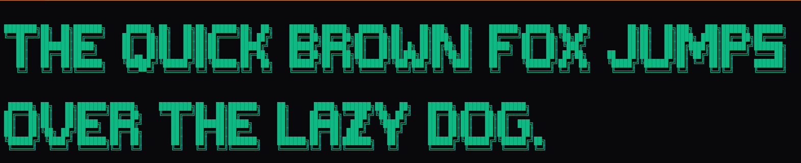
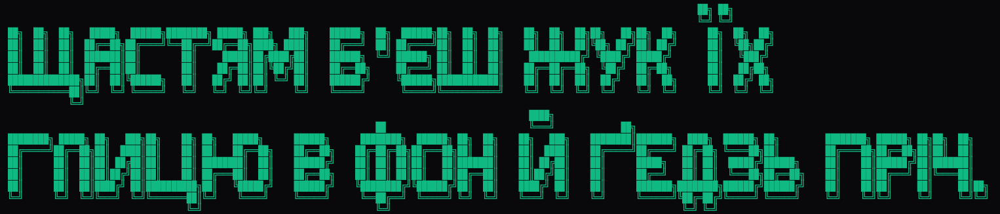
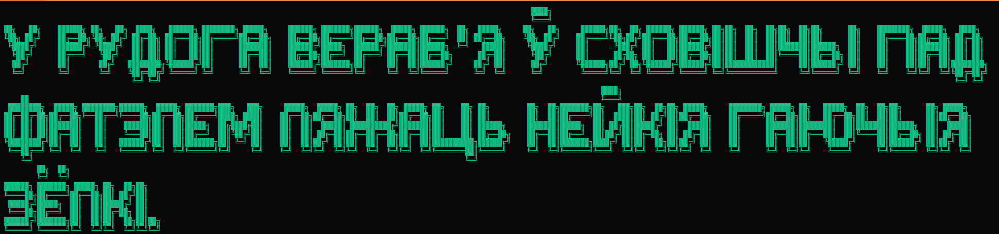
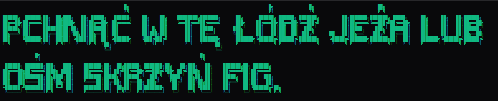

# ANSI Shadow Extended (`ansi_shadow_extended`)

An extended variant of the well-known FIGlet font **ANSI Shadow**, based on the Latin original. 
Height is 9 lines (vs. 7 in the original ANSI Shadow) to leave room for diacritics. 
It extends the original font to support additional languages. 

## Features

- **9 lines height** — expanded from original 7 lines.
- **Language support**:
  - Basic Latin (from the original ANSI Shadow).
  - Cyrillic (Ukrainian: А-Я, Ґ, Є, І, Ї; Belarusian: Ў, Ё, Ы, Э, І).
  - Latin Extended (Polish: Ą, Ć, Ę, Ł, Ń, Ó, Ś, Ź, Ż).

## Examples

### English


### Ukrainian


### Belarusian


### Polish


Note: Other Cyrillic alphabets (Russian, Serbian, etc.) are **not** included.

## Files

- `ansi_shadow_extended.flf` — the font file in FIGlet format.
- `install.py` — copies the font into the installed `pyfiglet/fonts/` directory.
- `demo.py` — renders a string with this font without persistent installation.

## Installation

```bash
pip install pyfiglet
python install.py
```

Test:

```bash
pyfiglet -f ansi_shadow_extended "Hello"
```

Remove from pyfiglet:

```bash
python install.py --uninstall
```

## Use in your own code

```python
import pyfiglet

# Option A: load .flf temporarily (idempotent; installs the font but does not require running install.py)
pyfiglet.FigletFont.installFonts("ansi_shadow_extended.flf")
print(pyfiglet.Figlet(font="ansi_shadow_extended").renderText("Hello"))

# Option B: after `python install.py` — use as a standard built-in font
print(pyfiglet.figlet_format("Hello", font="ansi_shadow_extended"))
```

## License

This extended variant is distributed under the **MIT License** (see [LICENSE](LICENSE)).
The underlying ANSI Shadow glyph design comes from the community FIGlet/TheDraw font family; the original author is undocumented (`Font Author: ?` in the source `.flf`).

## Author of the extended adaptation

Pan Vena (Lazy AIs), 2026.

---

## 🎮 Check out Dungeon Revizor: The Game!

This extended adaptation was originally created to be used in **Dungeon Revizor: The Game**. If you enjoy our open-source tools and assets, please consider supporting our team by adding the game to your Steam Wishlist! Your support helps us create more awesome stuff!
